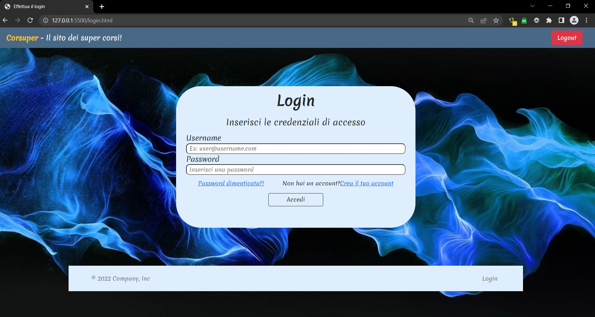
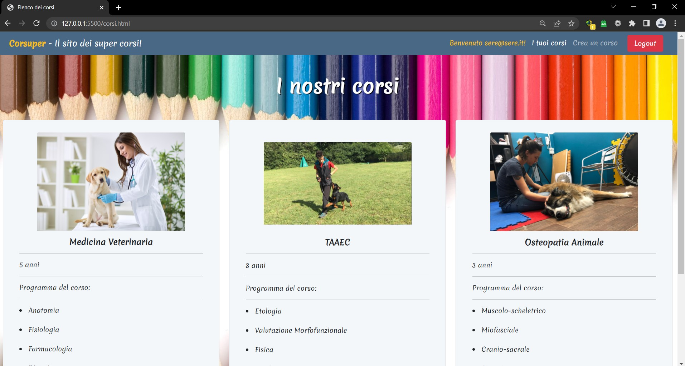
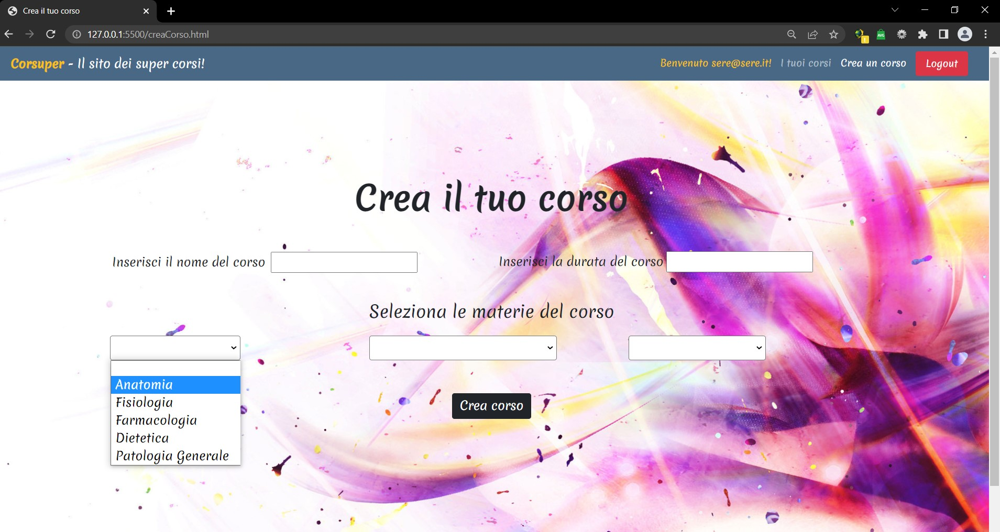

# WebPageCreaCorsi con Bootstrap
Pagina con Login di accesso (Pagina di registrazione non prevista dall'esercizio)  e barra di caricamento in JS.
Una volta effettuato l'accesso nella navbar compaiono l'username inserito, la pagina con i corsi offerti e la pagina per creare un nuovo corso (con i select riempiti dalle materie presenti nella piattaforma) con riepilogo a fondo pagina una volta che il corso è stato creato.

 Pagina di Login  
 Pagina con l'elenco dei corsi  
 Pagina per la creazione di un nuovo corso  
